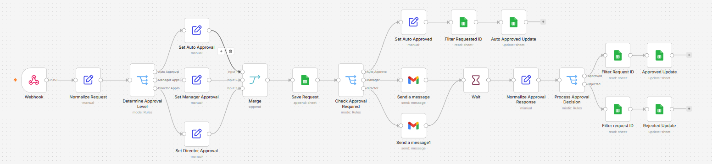

# Internal Operations Request Management

An automated internal request and approval workflow built with **n8n** to streamline request submission, approval routing, human decision-making, and status tracking.

## 🎯 Project Overview

Internal operational requests often require multiple approval levels and manual follow-up. This project automates the approval process while keeping human decision-makers in control.

The workflow determines the required approval level, routes the request to the appropriate approver, sends an email approval request, captures the decision, and updates the request status automatically.

## 💡 Business Problem

A typical internal approval process may involve:

* Employees submitting operational requests
* Different approval levels depending on the request
* Manual email communication with managers
* Difficulty tracking pending approvals
* Manual updates to request status
* Risk of requests being overlooked

This creates unnecessary administrative work and makes the approval process harder to monitor.

## 🚀 Solution

The workflow creates a centralized automation flow:

**Request → Approval Routing → Email Approval → Human Decision → Status Update**

The automation handles the repetitive process while leaving the actual approval decision to the responsible manager or director.

## 🔄 Workflow Architecture

```text
                    ┌──────────────────┐
                    │  Request Submit  │
                    └────────┬─────────┘
                             ↓
                    ┌──────────────────┐
                    │ Normalize Request│
                    └────────┬─────────┘
                             ↓
                  ┌──────────────────────┐
                  │ Determine Approval   │
                  │ Level                │
                  └──────────┬───────────┘
                             ↓
                  ┌──────────────────────┐
                  │ Approval Required?   │
                  └──────────┬───────────┘
                             ↓
                 ┌───────────┴───────────┐
                 ↓                       ↓
          Auto Approval          Manager / Director
                                         ↓
                                ┌────────────────┐
                                │ Approval Email │
                                └───────┬────────┘
                                        ↓
                                ┌────────────────┐
                                │ Human Decision │
                                └───────┬────────┘
                                        ↓
                              ┌─────────┴─────────┐
                              ↓                   ↓
                         Approved              Rejected
                              └─────────┬─────────┘
                                        ↓
                              ┌──────────────────┐
                              │ Update Request   │
                              │ Status           │
                              └──────────────────┘
```

## ✨ Key Features

### 1. Automated Request Intake

Requests enter the workflow through a webhook endpoint and are normalized into a consistent structure.

### 2. Approval Level Determination

The workflow automatically determines whether a request requires:

* No approval
* Manager approval
* Director approval

### 3. Automated Approval Routing

Requests are routed to the appropriate approval path based on the determined approval level.

### 4. Email-Based Approval

Approvers receive a structured HTML email containing the request information and approval actions.

### 5. Human-in-the-Loop Decision

The automation does not make the final business decision.

The responsible approver can choose:

**Approve** or **Reject**

The workflow then processes the decision automatically.

### 6. Centralized Status Tracking

Request information and approval decisions are recorded in **Google Sheets**, providing a simple operational tracking layer.

## 🛠️ Technology Stack

| Technology        | Purpose                                      |
| ----------------- | -------------------------------------------- |
| **n8n**           | Workflow automation and orchestration        |
| **Webhook**       | Request intake and approval callbacks        |
| **Gmail**         | Approval notification and decision interface |
| **Google Sheets** | Request and approval status tracking         |
| **HTML**          | Structured approval email                    |

## 📊 Example Process

A typical request follows this sequence:

1. Employee submits an operational request.
2. The workflow validates and normalizes the request.
3. Approval requirements are determined.
4. The request is automatically routed.
5. The approver receives an email.
6. The approver selects **Approve** or **Reject**.
7. The workflow processes the decision.
8. Google Sheets is updated with the latest status.

## 🎯 Project Highlights

This project demonstrates the use of automation to improve an operational business process rather than simply automating individual tasks.

Key design principles include:

* **Process automation**
* **Rule-based approval routing**
* **Human-in-the-loop automation**
* **Centralized status tracking**
* **Separation of business logic and automation logic**
* **Reusable workflow design**

## 📁 Repository Structure



```text
internal-operations-request-management/
│
├── README.md
│
├── assets/
│   ├── workflow-overview.png
│   └── approval-email.png
│
└── workflow/
    └── internal-operations-request-management-clean.json
```

## 🔐 Security & Privacy

The workflow shared in this repository is a sanitized version prepared for portfolio purposes.

It does not contain:

* API credentials
* Personal credentials
* Production webhook URLs
* Private Google Sheet identifiers
* Real operational request data

## 📌 Note

This project is a portfolio demonstration of an internal operations automation workflow built with n8n.

The workflow can be adapted to different internal request types, approval structures, and organizational processes.
